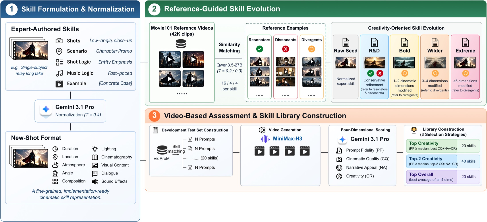

# SkillPE

**Creativity-oriented cinematic skill evolution for text-to-video prompt engineering.**

[Project page](https://yhuang.top/spe_webpage/) · Paper: coming soon · Citation: coming soon

SkillPE turns filmmaking knowledge into reusable, structured skills for prompt
engineering. It evolves expert-authored cinematic skills using movie references,
then selects skill libraries by assessing the videos they produce. The goal is
to improve cinematic quality, narrative appeal and creativity while preserving
the user's requested content.

## Method



Each skill captures shot logic and generation-ready details such as composition,
camera movement, lighting, timing and sound. Reference clips play three roles:
resonators reinforce useful matches, dissonants clarify when a skill should not
apply, and divergents inspire controlled alternatives. Candidate skills are
assessed on generated videos for prompt fidelity, cinematic quality, narrative
appeal and creativity.

## Example Results


The paper evaluates SkillPE on StoryEval and VBench with MiniMax-H3 and LTX-2.5.
On the authors' four-dimensional 7-point evaluation, selected libraries improve
by up to **1.40 points** over the strongest external prompt-engineering baseline
and **0.51 points** over seed-skill prompting. In a blinded study with ten
annotators, the best SkillPE variant scores **5.97** overall, compared with
**5.61** for seed-skill prompting. These are cinematic, narrative and creativity
ratings; benchmark-native metrics are reported separately in the paper.

## Repository Contents

- `skillpe/`: experiment orchestration, prompt engineering, generation, scoring
  and skill-library selection.
- `artifacts/expert_authored/`: 20 expert-authored seed skills.
- `artifacts/normalized_seed/`: 20 normalized, generation-oriented skills.
- `configs/`: example MiniMax-H3 and LTX-2.5 settings.
- `prompts/`: prompt templates for skill evolution and evaluation.

## Quick Start

Requires Python 3.10 or newer. Install FFmpeg and FFprobe for video workflows.

```bash
python -m venv .venv
source .venv/bin/activate
python -m pip install -e .
python -m skillpe --help
```

Model services, checkpoints and benchmark inputs are not bundled. See the
[installation and experiment guide](#installation) and [`env.example`](env.example)
for configuration. Multi-machine runs require a shared filesystem that supports
cross-host `flock`.

## Citation

Paper and citation details are coming soon. The repository includes a
[`CITATION.cff`](CITATION.cff) metadata file; it will be updated with the public
paper record when available.

## Project Page

More project information and video examples: [yhuang.top/spe_webpage](https://yhuang.top/spe_webpage/).

## Installation

Run commands from this directory using Python 3.10+ on Linux. Install FFmpeg and
FFprobe. Multi-machine runs require a shared filesystem supporting cross-host
`flock`.

```bash
python -m venv .venv
source .venv/bin/activate
python -m pip install -e '.[analysis]'
python -m skillpe --help
```

For reference retrieval or local baselines, install the corresponding extras:

```bash
python -m pip install -e '.[retrieval]'
python -m pip install -e '.[baselines]'
```

Install the required model runtimes separately and download checkpoints to the
paths configured in `configs/h3.json` or `configs/ltx_enhanced.json`. Use separate
Python environments when backend dependencies conflict. RAPO requires the assets
under its configured `assets` directory, including
`author/llama3_1_instruct_lora_rewrite`.

## Configuration and inputs

Export these environment variables as needed; see `env.example`:

- `GEMINI_API_KEY`, `GEMINI_API_ENDPOINT`: native `generateContent` endpoint,
  optionally containing `{model}`.
- `GEMINI_AUTH_MODE`: `api-key` or `bearer`.
- `H3_BASE_URL`: running H3 service exposing `/v1/videos`, status polling and
  video download routes as used in `skillpe/generation.py`.
- `QWEN_API_ENDPOINT`: full chat-completions URL serving Qwen3.6-27B for annotation.
- `DEEPSEEK_API_ENDPOINT`: full chat-completions URL serving DeepSeek-V4-Pro for
  skill summaries.
- `QWEN_API_KEY`, `DEEPSEEK_API_KEY`: set if those endpoints require authentication.

Prepare these inputs:

| Input | Required fields or files |
| --- | --- |
| Benchmark JSONL | `prompt_id`, `benchmark` (`storyeval` or `vbench`), `prompt`; optional integer `seed`; `events` required for StoryEval scoring |
| Benchmark exclusion JSONL | Complete union of StoryEval and VBench prompt rows |
| VidProM JSONL | `prompt_id`, `prompt`, available toxicity fields; pre-annotated input also needs `category` and `narrative_complexity` |
| Reference JSONL | Globally unique `id`, `dataset`, `caption`, local `video_path`, `start`, `end` in seconds |
| VBench evaluation | Official annotation JSON, evaluator checkout and local evaluator weights |

Configure video backends to produce 1344×768, 240 frames at 24 FPS, 10-second
video with 32-kHz stereo AAC audio. Use a new run directory when changing config,
inputs or prompts. Set per-row `seed` values or the config's `generation_seed`.

## Build candidate skills

Use `artifacts/normalized_seed` directly, or regenerate normalization:

```bash
python -m skillpe normalize --root runs/normalization
python -m skillpe worker --root runs/normalization --config configs/h3.json --channel normalize --concurrency 20
python -m skillpe collect --root runs/normalization --channel normalize --output runs/normalized.json
```

Run the following stages in order, allowing each worker to finish before starting
the next stage:

```bash
python -m skillpe visual-summaries --output runs/visual_summaries.json
python -m skillpe retrieve --references inputs/references.jsonl --summaries runs/visual_summaries.json --checkpoint models/Qwen3-Embedding-8B --output runs/retrieved.json
python -m skillpe reference-publish --input runs/retrieved.json --root runs/development_sources
python -m skillpe worker --root runs/development_sources --config configs/h3.json --channel reference --concurrency 32
python -m skillpe evolve --root runs/development_sources
python -m skillpe worker --root runs/development_sources --config configs/h3.json --channel evolve --concurrency 20
python -m skillpe catalog --root runs/development_sources --output runs/catalog.json
```

To use regenerated normalization, add `--skills runs/normalized.json` to `evolve`
and `catalog`. Keep the default expert skills for `visual-summaries`, `retrieve`
and `development-set`.

## Build the development set and select libraries

```bash
python -m skillpe annotate --root runs/source_annotation --input inputs/vidprom.jsonl
python -m skillpe worker --root runs/source_annotation --config configs/h3.json --channel annotate --concurrency 64
python -m skillpe collect --root runs/source_annotation --channel annotate --output runs/annotated.json
python -m skillpe development-set --input runs/annotated.json --exclude inputs/all_benchmark_prompts.jsonl --output runs/development.json
python -m skillpe publish --root runs/dev_h3 --config configs/h3.json --manifest runs/development.json --catalog runs/catalog.json --exclude inputs/all_benchmark_prompts.jsonl
```

Start each process below in a separate terminal:

```bash
python -m skillpe worker --root runs/dev_h3 --config configs/h3.json --channel pe --concurrency 64 --watch
python -m skillpe bridge --root runs/dev_h3 --config configs/h3.json --watch
python -m skillpe worker --root runs/dev_h3 --config configs/h3.json --channel h3 --watch
python -m skillpe worker --root runs/dev_h3 --config configs/h3.json --channel gemini --concurrency 256 --watch
```

After all development videos have valid scores, select the libraries:

```bash
python -m skillpe status --root runs/dev_h3
python -m skillpe select --root runs/dev_h3 --catalog runs/catalog.json --output runs/selected
```

For LTX selection, repeat publishing, workers and selection with
`configs/ltx_enhanced.json`, generation channel `ltx`, a separate run directory
such as `runs/dev_ltx`, and a separate output such as `runs/selected_ltx`.

## Run benchmarks

Edit `configs/libraries.example.json` to point to the selected libraries.

```bash
python -m skillpe publish --root runs/main_h3 --config configs/h3.json --manifest inputs/storyeval.jsonl --libraries configs/libraries.example.json --arms raw direct vpo prompt_a_video mora seed top top2 overall rapo
```

Remove unwanted methods from `--arms`. Start each process below in a separate
terminal, adjusting API concurrency to available capacity:

```bash
python -m skillpe worker --root runs/main_h3 --config configs/h3.json --channel pe --concurrency 64 --watch
python -m skillpe bridge --root runs/main_h3 --config configs/h3.json --watch --storyeval
python -m skillpe worker --root runs/main_h3 --config configs/h3.json --channel gemini --concurrency 256 --watch
python -m skillpe worker --root runs/main_h3 --config configs/h3.json --channel storyeval --concurrency 32 --watch
python -m skillpe worker --root runs/main_h3 --config configs/h3.json --channel h3 --watch
```

For each selected local baseline, also start its worker in a separate terminal
with the required environment and GPU:

```bash
python -m skillpe worker --root runs/main_h3 --config configs/h3.json --channel vpo --watch
python -m skillpe worker --root runs/main_h3 --config configs/h3.json --channel prompt_a_video --watch
python -m skillpe worker --root runs/main_h3 --config configs/h3.json --channel mora --watch
python -m skillpe worker --root runs/main_h3 --config configs/h3.json --channel rapo --watch
```

Keep concurrency at 1 for H3, LTX and local baseline workers. Assign separate
GPUs with `CUDA_VISIBLE_DEVICES` when running multiple GPU processes. Stop
`--watch` processes with Ctrl+C after the run finishes.

For VBench, use `inputs/vbench.jsonl` and a separate root such as
`runs/vbench_h3`; omit the bridge's `--storyeval` flag and the StoryEval worker.
For generation-only runs, use `bridge --no-score` and omit scoring workers.

For LTX, use `configs/ltx_enhanced.json` and a separate root such as
`runs/main_ltx` throughout publishing, bridging and workers. Replace the H3
generation worker with:

```bash
CUDA_VISIBLE_DEVICES=0 python -m skillpe worker --root runs/main_ltx --config configs/ltx_enhanced.json --channel ltx --watch
```

To disable LTX prompt enhancement, copy the config, set `enhance_prompt` to
`false`, and use that config for the new run.

## Collect results

```bash
python -m skillpe status --root runs/main_h3
python -m skillpe summarize --root runs/main_h3 --output runs/main_h3/summary.json
python -m skillpe collect --root runs/main_h3 --channel storyeval --output runs/main_h3/storyeval.json
python -m skillpe.official --root runs/vbench_h3 --backbone h3 --arm top --output runs/official_top --full-info inputs/VBench_full_info.json --repo external/VBench
```

Repeat the VBench evaluator command for each arm. Use `--dimension` followed by
dimension names to run a subset of dimensions.

## Run ablations

```bash
python -m skillpe ablation-libraries --catalog runs/catalog.json --selected runs/selected --output runs/ablations
```

Map the generated library files under `runs/ablations/A`, `C` or `D` to arm names
in a libraries JSON, then use the benchmark publishing and worker commands above.

For word-budget runs, publish Direct, Seed, Top and Overall with
`--arms direct seed top overall --word-budget 100`. Repeat with budgets `200`,
`400` and `800`, using a separate run directory for each budget.

## Run tests

```bash
PYTHONDONTWRITEBYTECODE=1 python -m unittest discover -s tests -v
```
